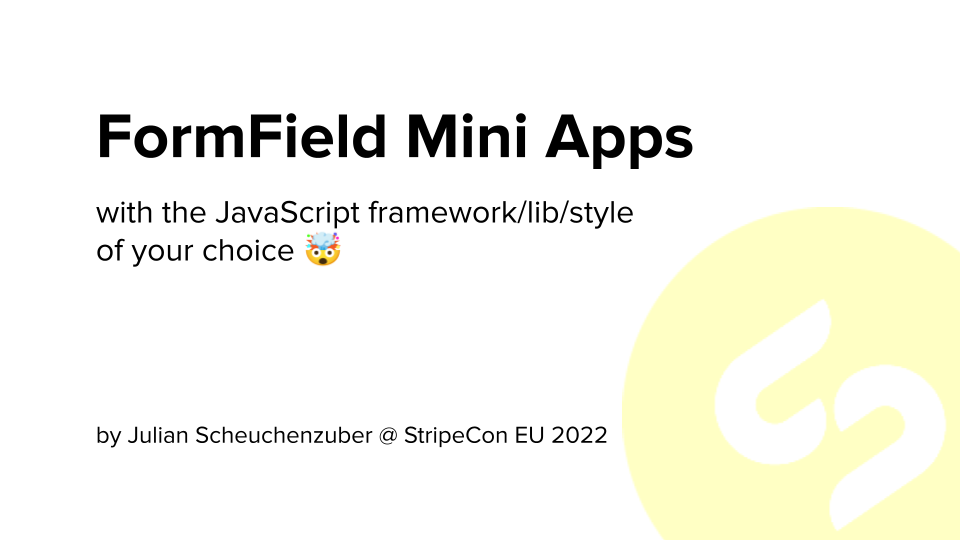

Demo repository for Lightning Talk "**FormField Mini Apps** with the JavaScript framework/lib/style of your choice" @ [StripeCon EU 2022](https://stripecon.eu) in Stockholm.

---

## `[tl:dr]`

You can solve complex workflow and UX use cases with JavaScript-powered Silverstripe FormFields (or *Mini Apps*).

**Advantages**:

👍  Can be used within Silverstripe EditForms

👍  Full flexibility when talking to async APIs

👍  Hydrate Mini App with "backend data" (e.g. user id, api key, ...)

🤯  Not forced to use jQuery Entwine or React


## Recipe

### 1. Create your JavaScript app

Use Vue, Angular, Svelte, ... or even just plain Vanilla JavaScript. The sky is the limit.
The [official recommendation](https://docs.silverstripe.org/en/4/getting_started/directory_structure/) is to create it in the `client/` directory of your project/module:

> "More complex projects can alternatively contain frontend assets in a common client folder"

Make sure that single files are being generated for your fields/Mini Apps.

A [vite-generated Vue app](app/client) is used in this demo.

### 2. Wire your JavaScript app to Silverstripe

My recommendation is to create a custom `FormField` as a descendant of `LiteralField`. The following shows a somewhat generic solution.

```php
<?php

namespace L51\Sandbox;

use SilverStripe\Forms\LiteralField;
use SilverStripe\View\Requirements;

class AppField extends LiteralField
{
    public function __construct($fieldName, $appName, $payload = [])
    {
        Requirements::css('app/client/dist/style.css');
        Requirements::javascript("app/client/dist/$appName.js");

        parent::__construct(
            $fieldName,
            "<div
                id='AppField_$fieldName'
                class='app-field $appName'
                data-payload='" . json_encode($payload) . "'></div>"
        );
    }
}
```

Example Usage:

```php
<?php

use L51\Sandbox\AppField;
use SilverStripe\CMS\Model\SiteTree;
use SilverStripe\Core\Environment;

class Page extends SiteTree
{

    public function getCMSFields()
    {
        $fields = parent::getCMSFields();

        $fields->addFieldToTab(
            'Root.Main',
            AppField::create(
                'DemoGifField',
                'gif-field', // <--- will be used as css class selector and has to match first param of watchElement()
                [
                    'apiKey' => Environment::getEnv('TENOR_API_KEY'),
                    'topic'  => 'nerds'
                ]
            ),
            'Title'
        );

        return $fields;
    }
}
```

### 3. Data flows JavaScript app <---> Silverstripe

#### Silverstripe --> JavaScript app

As shown in the snippets above, `AppField` expects a third parameter `$payload` which should be an array.
The JSON representation will be included in the wrapper-`div`'s dataset scope (`data-payload`). This way the data
will be accessible for the JavaScript app for hydration/configuration.

```typescript
const render = (el: HTMLElement) => {
    const payload = JSON.parse(el.dataset.payload as string);

    createApp(GifField, {
        apiKey: payload.apiKey,
        topic: payload.topic
    }).mount(`#${el.id}`);;
}
```

#### JavaScript app --> Silverstripe

There are various ways to send data from the JavaScript app back to Silverstripe. You can easily create your
own REST-style routes and make API requests or use the built-in GraphQL capabilities of Silverstripe.

One thing we should not forget about is the fact that **FormFields are RequestHandlers** and hence, siblings of Controllers (that's right!).

In our example:

```
AppField
 - LiteralField
  - DatalassField
   - FormField
    - RequestHandler 
```

**Recommended reading**: [Zauberfisch](https://github.com/Zauberfisch) was giving a nice talk about this topic 
(["SilverStripe FormFields and the magic beyond `<input type=text/>`"](https://slides.zauberfisch.at/2017/stripecon17-formfields/
)) at StripeCon EU 2017 in Malta.

Hence, you can simply create actions on your custom FormField (e.g. `AppField`) and call them REST-style.

Another possible solution could be to take make your FormField getting picked up by an EditForms `saveInto()` traversal.

## Feedback?

If you have comments or questions open an issue or reach out over the Silverstripe Slack to *JZubero* (me).

🖖
